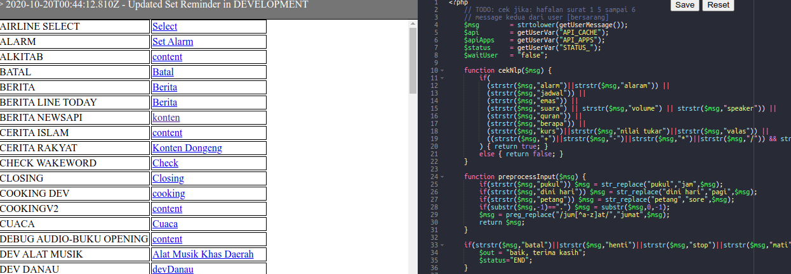

# PHP Editor with Compose

PHP editor with table-like file structure. This project was meant to help me to edit value in database (Postgres) without opening heavy third-party db editor apps.

Simply run this command:
```
$ bash dev.sh
```
and you're good to go.

Terminal's log snap;
```
WARNING: Found orphan containers (rules-editor-prod, rules-mysql-prod) for this project. If you removed or renamed this service in your compose file, you can run this command with the --remove-orphans flag to clean it up.
Starting rules-mysql ... done
Starting rules-editor ... done
Attaching to rules-mysql, rules-editor
rules-mysql     | 2020-10-20T00:15:51: PM2 log: Launching in no daemon mode
rules-mysql     | 2020-10-20T00:15:51: PM2 log: App [server:0] starting in -fork mode-
rules-mysql     | 2020-10-20T00:15:51: PM2 log: App [server:0] online
rules-editor    | 2020-10-20T00:15:57: PM2 log: Launching in no daemon mode
rules-editor    | 2020-10-20T00:15:58: PM2 log: App [server:0] starting in -fork mode-
rules-editor    | 2020-10-20T00:15:58: PM2 log: App [server:0] online
rules-mysql     | Example app listening at http://localhost:3003
rules-mysql     | MongoDB database connection established successfully
rules-editor    | Example app listening at http://localhost:3000
rules-editor    | 2020-10-20T00:27:41.248Z - Updated Set Reminder
rules-editor    | 2020-10-20T00:34:23.820Z - Updated debugging
rules-editor    | 2020-10-20T00:35:08.443Z - Updated Set Reminder
rules-editor    | 2020-10-20T00:37:19.871Z - Updated Set Reminder
rules-editor    | 2020-10-20T00:38:43.874Z - Updated Set Reminder
rules-editor    | 2020-10-20T00:43:14.330Z - Updated Set Reminder
rules-editor    | 2020-10-20T00:44:12.810Z - Updated Set Reminder
^CGracefully stopping... (press Ctrl+C again to force)
Stopping rules-editor ... done
Stopping rules-mysql  ... done

```

UI's snap:
